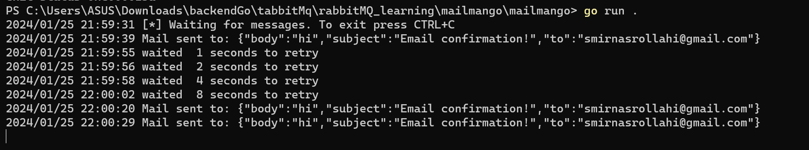

# MAILMANGO
## INTRODUCTION
A mailing service worker to [Bago](https://github.com/ericklima-ca/bago).
It receives messages from a queue on the rabbitmq server and send email as requested, if the message is valid. 
The message must have the format like [Message](#message-struct).
To connect to the server, set `RABBITMQ_URL` environment variable.
For now, it only accepts the gmail server (setted host and port to `"smtp.gmail.com:465"`).
In this case, it is needed set `EMAIL_ADDR` and `EMAIL_PASS` environments variables, where `EMAIL_PASS` is the password got like [this](https://support.google.com/accounts/answer/185833?hl=en).
## MESSAGE STRUCT
``` go
type message struct {
	To      []string `json:"to,omitempty"`
	Subject string   `json:"subject,omitempty"`
	Body    string   `json:"body,omitempty"`
}
```

#info
at first this project was inspired by https://github.com/ericklima-ca/mailmango and then i began to rewite it.<br>
now have the ability to try ten times and the delay is first 1 seconds, then 2, then 4 and ...:
<br>
